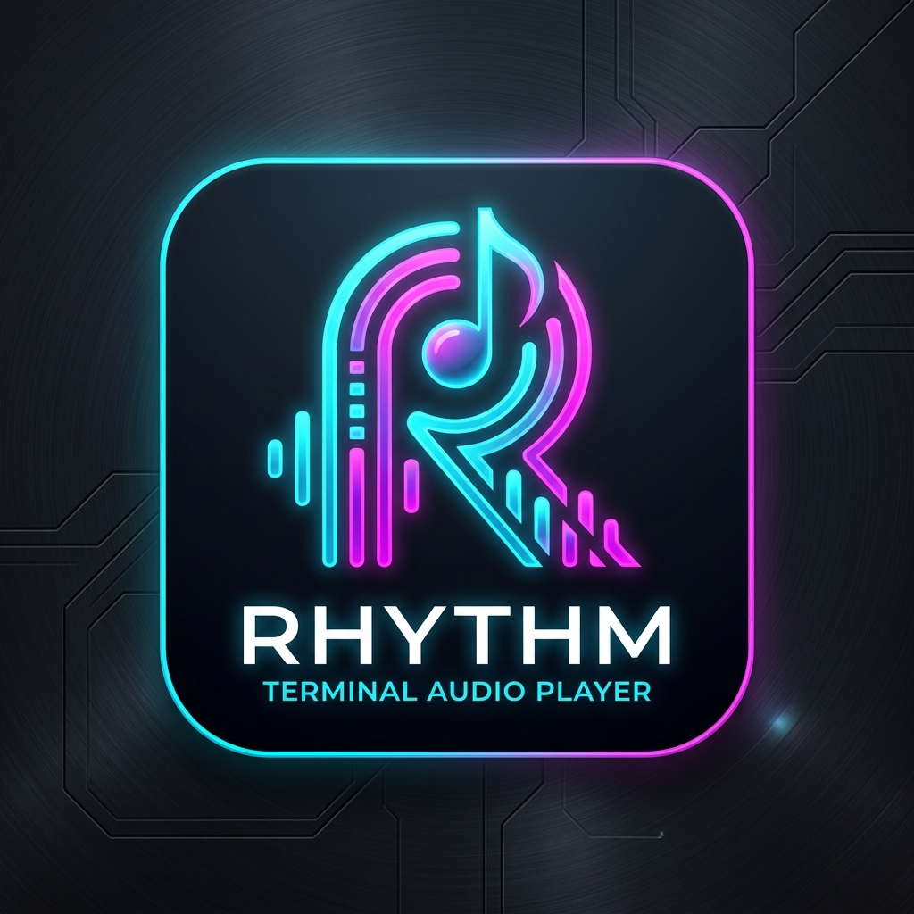
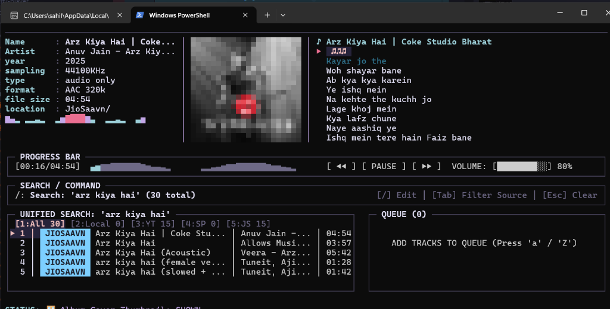
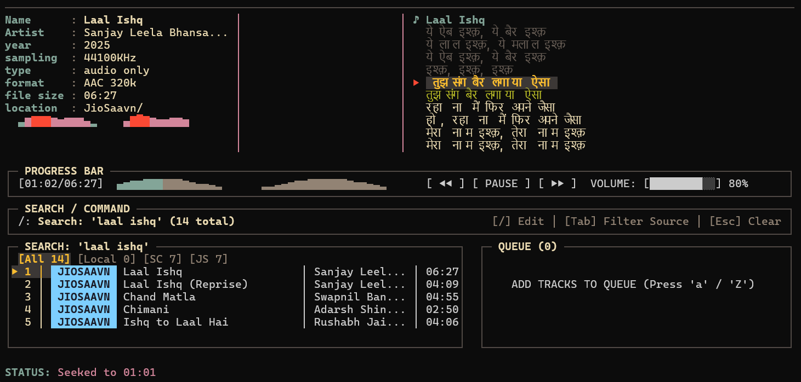
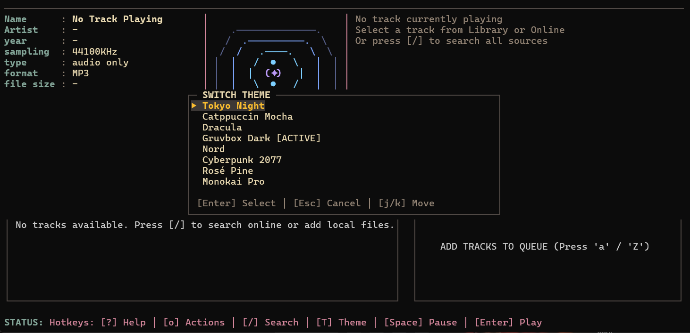
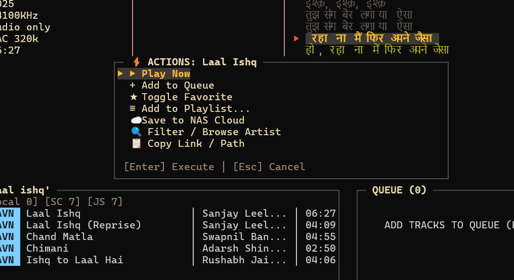
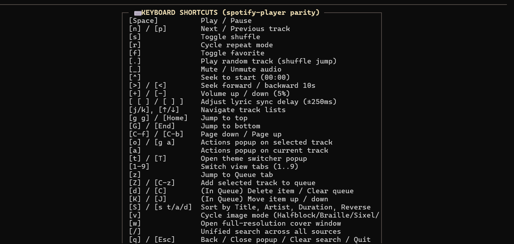

[](https://github.com/aikyaam/rhythm/releases/latest)
[](https://pkg.go.dev/github.com/aikyaam/rhythm)
[](https://github.com/aikyaam/rhythm/blob/main/LICENSE)
[](https://github.com/aikyaam/rhythm/releases)



# Rhythm

a music player that lives in your terminal. no electron, no browser, no bullshit — just a TUI written in Go that can pull songs from JioSaavn, SoundCloud, Gaana, Tidal, Archive.org, or your own local library and play them right there in the shell.

i built this because i wanted something fast, hackable, and that didn't need me to open a browser just to listen to music. it's still early days but it works well enough that i'm using it daily.

## what's in here

1. [what it does](#what-it-does)
2. [getting it running](#getting-it-running)
3. [how it works](#how-it-works)
4. [keybindings](#keybindings)
5. [screenshots](#screenshots)
6. [examples](#examples)
7. [license](#license)

---

## what it does

- **terminal UI** — built with [Bubbletea](https://github.com/charmbracelet/bubbletea). keyboard-driven, fast, no mouse needed.
- **pure Go audio** — uses Oto + Beep for audio output. no CGO, no native libs, builds cross-platform cleanly.
- **multi-source search** — press `/` and it searches across everything at once:
  - JioSaavn (320kbps AAC)
  - SoundCloud
  - Gaana (HLS)
  - Monochrome / Tidal (lossless FLAC/AAC)
  - SongLink / Odesli (finds links across platforms)
  - Archive.org (public domain, live recordings)
  - your local files (FLAC, MP3, M4A, WAV, Opus, AAC)
- **no preview garbage** — if a source only has a 30s preview, rhythm automatically falls back to YouTube or another source for the full track. you never get cut off.
- **synced lyrics** — fetches from LRCLIB and highlights the current line in real time. you can nudge the timing with `[` and `]` if it's off.
- **album art in terminal** — renders cover art as halfblocks, braille, sixel, kitty, or iterm2 depending on what your terminal supports. press `v` to cycle through modes.
- **server mode** — run `rhythm-server` on a box connected to speakers (raspberry pi, NAS, whatever) and control it from your laptop over the network.

---

## getting it running

### pre-built binaries

grab the latest from [releases](https://github.com/aikyaam/rhythm/releases). linux, macOS, and windows on both amd64 and arm64.

**linux / macOS:**
```bash
curl -fsSL -o rhythm.tar.gz https://github.com/aikyaam/rhythm/releases/latest/download/rhythm-v0.1.0-linux-amd64.tar.gz
tar -xzf rhythm.tar.gz
sudo mv rhythm-linux-amd64/rhythm /usr/local/bin/
sudo mv rhythm-linux-amd64/rhythm-server /usr/local/bin/
```

**windows (powershell):**
```powershell
Invoke-WebRequest -Uri "https://github.com/aikyaam/rhythm/releases/latest/download/rhythm-v0.1.0-windows-amd64.zip" -OutFile "rhythm.zip"
Expand-Archive -Path "rhythm.zip" -DestinationPath "$HOME\rhythm"
# then add $HOME\rhythm to your PATH
```

### via go install

```bash
go install github.com/aikyaam/rhythm/cmd/rhythm@latest
go install github.com/aikyaam/rhythm/cmd/rhythm-server@latest
```

### build from source

```bash
git clone https://github.com/aikyaam/rhythm.git
cd rhythm
go build -trimpath -ldflags="-s -w" -o bin/rhythm ./cmd/rhythm
go build -trimpath -ldflags="-s -w" -o bin/rhythm-server ./cmd/rhythm-server
```

---

## how it works

two modes:

- **standalone** — just run `rhythm`. everything runs locally, audio plays through your machine.
- **server mode** — run `rhythm-server` on a remote box (raspberry pi, VPS, NAS). then connect to it from anywhere with `rhythm --server http://192.168.1.x:8080`. the audio plays on the server side, you control it from your terminal.

flags for `rhythm`:
```
--server    connect to a rhythm-server (e.g. http://nas:8080)
--config    custom config file path (default: ~/.config/rhythm/config.json)
--version   print version and exit
```

flags for `rhythm-server`:
```
--port       port to listen on (default: 8080)
--host       host to bind (default: 0.0.0.0)
--music-dir  path to music folder to index
--db         sqlite db path (default: ~/.config/rhythm/server.db)
```

---

## keybindings

| key | what it does |
|:----|:-------------|
| `/` | search everything |
| `Enter` | play |
| `Space` | pause / resume |
| `n` / `p` | next / previous |
| `j` / `k` or `↓` / `↑` | move through list |
| `Tab` / `Shift+Tab` | switch between panes |
| `l` | toggle lyrics |
| `v` | cycle album art render mode |
| `w` | pop out full-res cover art window |
| `t` / `T` | theme switcher |
| `o` | actions menu on selected track |
| `f` | favorite toggle |
| `[` / `]` | lyric sync offset ±250ms |
| `q` / `Esc` | go back / close popup / quit |

---

## screenshots

<p align="center">
  
</p>

| synced lyrics | theme picker |
|:---:|:---:|
|  |  |
| track actions | shortcuts |
|  |  |

---

## examples

**just run it:**
```bash
rhythm
```

**server on a pi:**
```bash
# on the pi
rhythm-server --port 8080 --music-dir /mnt/nas/music

# on your laptop
rhythm --server http://raspberrypi.local:8080
```

**systemd service** (so it starts on boot):

`/etc/systemd/system/rhythm-server.service`:
```ini
[Unit]
Description=Rhythm Server
After=sound.target network.target

[Service]
Type=simple
User=music
ExecStart=/usr/local/bin/rhythm-server --port 8080 --music-dir /srv/music
Restart=always

[Install]
WantedBy=multi-user.target
```

```bash
sudo systemctl daemon-reload
sudo systemctl enable --now rhythm-server
```

---

## license

MIT — see [LICENSE](LICENSE).
